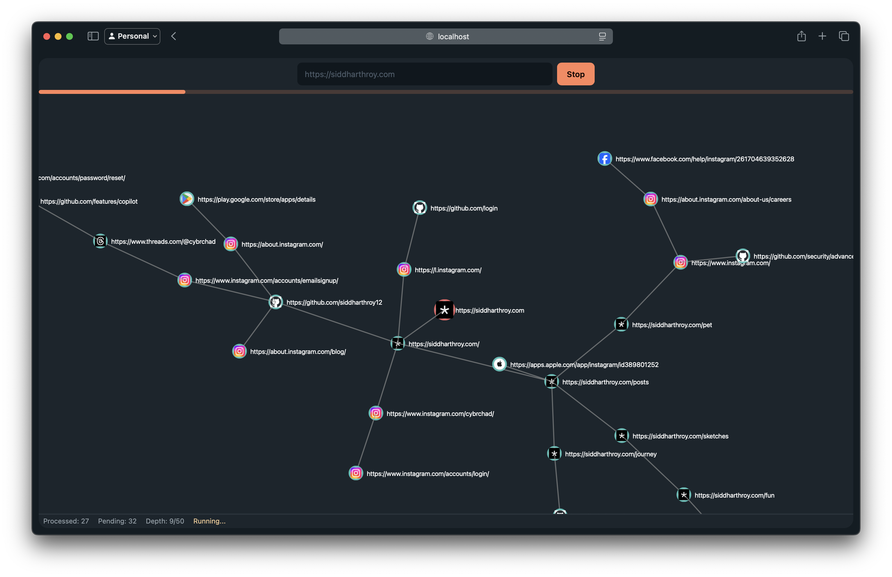
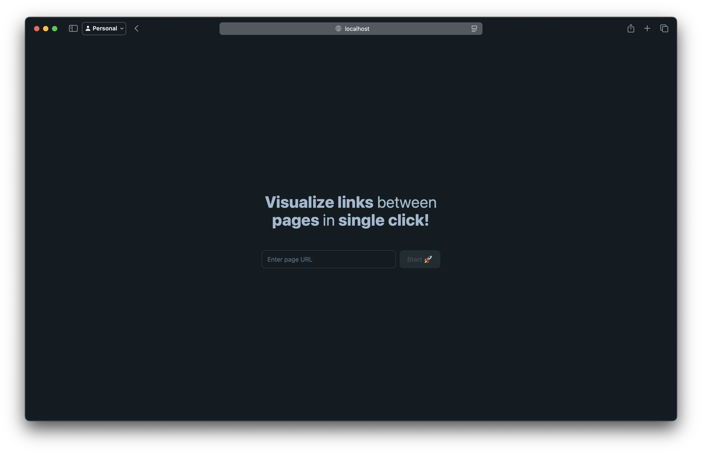

# Link Explorer


A tool (toy?) that generates an interactive graph visualization of all hyperlinks found on a given web page. Input any URL, and slowly see how that page connects to the rest of the web.

## 🚀 Features

- **Automated Link Extraction:** Scan any web page to collect all outbound links.
- **Graph Visualization:** Slowly generate a visual graph where nodes represent URLs and edges represent direct hyperlinks.
- **Interactive Graph:** Hover, zoom, and click on nodes for detailed inspection.

## 🖼️ Screenshots




## 🏗️ How It Works

1. **Input:** Enter a target webpage URL.
2. **Extraction:** The backend scrapes the page, and returns the HMTL to the frontend which then extract all the links.
3. **Graph Construction:** Each link is a node; each direct link forms a connection (edge).
4. **Visualization:** Rendered using D3.js

## ⚡️ Quick Start

```bash
# Clone repo
git clone https://github.com//web-link-graph-visualizer.git

# Create python env
python -m venv .venv
source .venv/bin/activate

# Install python deps
pip install -r server/requirements.txt

# Run server
python server/main.py

# Install client deps
cd client
npm install
npm run dev
```

Then, open your browser and go to `http://localhost:5173` to use the app.

If the above steps don't work then feel free to compain in issues tab.

## 📦 Tech Stack

| Component       | Tech                     |
| --------------- | ------------------------ |
| Backend         | Python, Flask, Zendriver |
| Frontend        | Svelte KIT, Daisy UI     |
| Graph Rendering | D3.js                    |

## 📋 API

```http
POST /api/get_html
{
  "url": "https://example.com"
}
```

Returns the html

```json
{
  "html": "<p>W API</p>"
}
```

## 📄 License

MIT License. I'm too lazy to put an license file.
